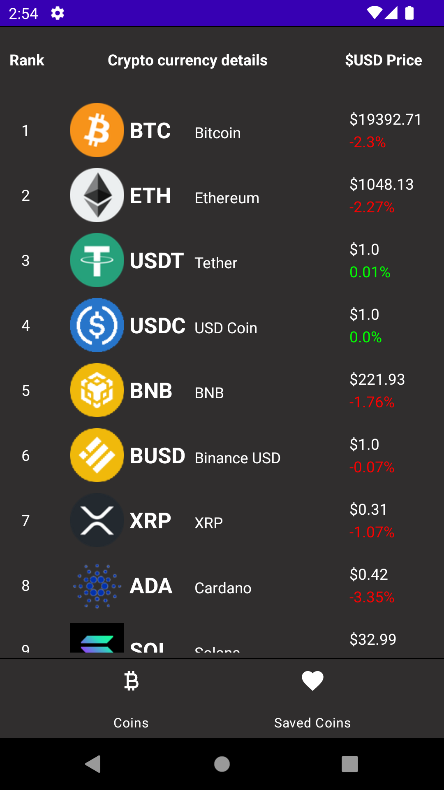
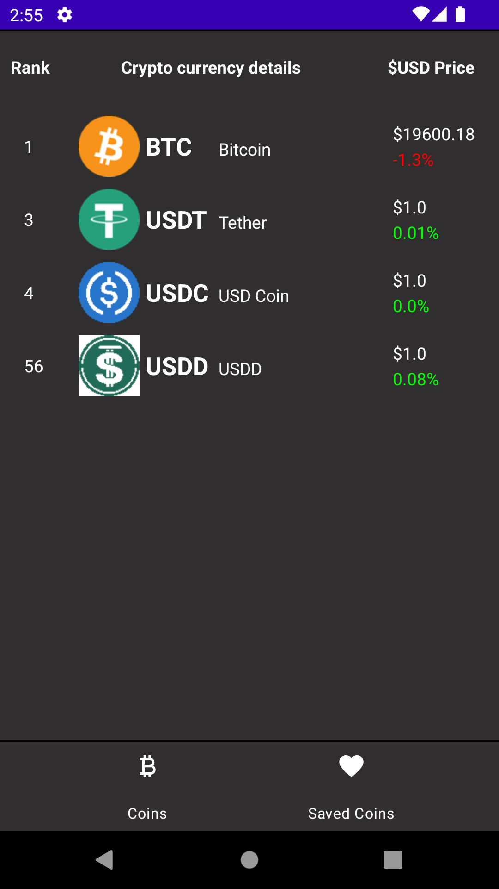
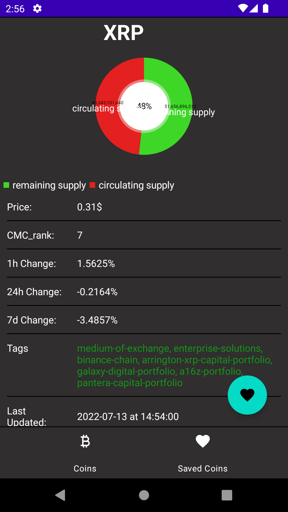

# CoinTrackerApp
-------------
Simple android app created with android clean architecture principles. Main goal of app is to follow the changes on the stock market. 
Functionalities of application:
* GetCoinsFromAPI - with Retrofit
* SaveCoinToDB - to room
* GetSavedCoins - from room
* UpdateCoins - Retrofit/room
* DeleteCoin - from room

## Screenshots & Gifs:
### Coins - Main menu


### Saved Coins


### Coin Info


### Application behavior


## Installation
1. Download .zip 
or clone the source locally
```sh
$ git clone https://github.com/Daves9809/CoinTrackerApp
```
2. Add CoinMarketCap properties:
  - MY_KEY - unique_api_key
  - MY_URL - "https://pro-api.coinmarketcap.com"
to gradle.properties.

## Library
* [Room Persistence Library](https://developer.android.com/topic/libraries/architecture/room)
* [Coroutines](https://developer.android.com/kotlin/coroutines)
* [Retrofit](https://square.github.io/retrofit/)
* [Dagger-Hilt](https://developer.android.com/training/dependency-injection/hilt-android)
* [Navigation](https://developer.android.com/guide/navigation)
* [Gson](https://github.com/google/gson/)
* [Glide](https://square.github.io/retrofit/)
* [OkHttp](https://github.com/square/okhttp)
* [MPAndroidChart](https://github.com/PhilJay/MPAndroidChart)

## API
* [CoinMarketCap](https://coinmarketcap.com)

## App Architecture
* MVVM
* Kotlin
